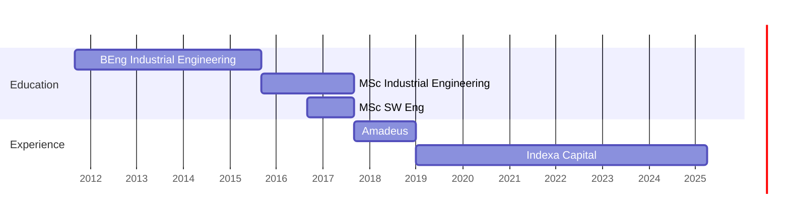

<!-- **venturarome/venturarome** is a ✨ _special_ ✨ repository because its `README.md` (this file) appears on your GitHub profile. -->

# Ventura Mendo

👋 Hi there! I'm a software developer since 2017, passionate about building clean, and efficient solutions. I’m especially interested in web development and automations.

📫 You can reach me on ,  or just open a topic on .

---

## 🎯 My Timeline Visualized

---

## 💻 Programming Languages
- **Professional**:
    
    
- **Competent**: 
    
    
    
    
    
- **Explorer**: 
    
    
    

## 🧰 Other technologies and tools
- **Professional**:
    
    
    
    
    
    
    
    
    
    
    
- **Competent**:
    
    
    
    
    
    
    
    
    
    
    
